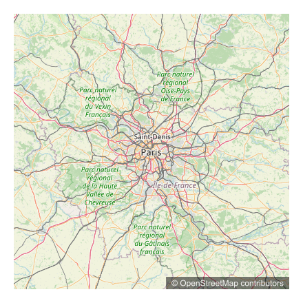

# Border

The map service supports an optional `border` query parameter to control whether a border is added to the generated image and to customize its appearance.

## Basic Behavior

- The border is **not added by default** (if nothing is passed).
- If only partial information is provided, only the specified properties are applied.

## Parameter Format

The `border` parameter accepts key-value pairs separated by `|`, for example:

```
&border=width:2|color:#ff0000
```

## Supported Keys

| Key | Description | Example |
| --- | --- | --- |
| width | Border width in pixels (integer) | `width:3` |
| color | Border color in hexadecimal format. Must be e.g. `#ffffff`; the missing `#` will be added automatically | `color:ff0000` |

<details>
  <summary>Border example request</summary>
  <p>http://localhost:3000/api/staticmaps?width=400&height=400&center=48.8566,2.3522&zoom=8&basemap=osm&border=width:20|color:ffff</p>
</details>


