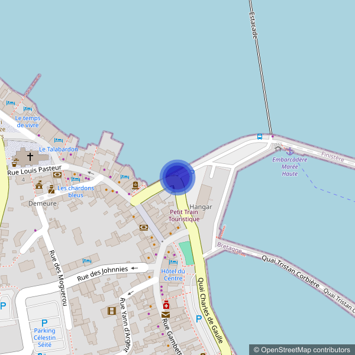

# Circles

To add a circle, use the `circle` parameter in this format:

```
circle=circleStyle|circleCoord
```

- **circleCoord**: Coordinates for the circle's center in lat, lon format, separated by |. You need at least one coordinate.
- **circleStyle**: Customize the circle with:

  | Parameter | Default    | Description                              |
  | --------- | ---------- | ---------------------------------------- |
  | `radius`  | (required) | Specifies the radius of the element.     |
  | `color`   | `#0000bb`  | Defines the stroke color of the element. |
  | `width`   | `3`        | Sets the stroke width of the element.    |
  | `fill`    | `{color}`  | Specifies the fill color of the element. |

**Example**: Circle with a radius of `20` meters.

```
http://localhost:3000/api/staticmaps?width=600&height=600&basemap=osm&circle=radius:20|color:4874dbb2|fill:0000bbbd|width:10|48.726304979176675,-3.9829935637739382
```


