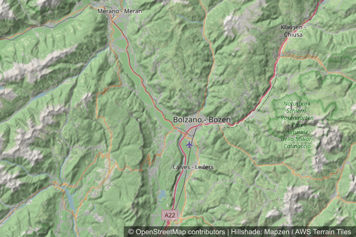

# Hillshade

The map service supports an optional `hillshade` query parameter that composites a shaded-relief overlay on top of the basemap. The overlay is rendered server-side from a Terrarium-encoded raster-DEM tile source and blended with the basemap using a `multiply` operation, so highlights leave the basemap untouched and shadows darken it.

## Basic Behavior

- Hillshade is **off by default**.
- When enabled, a short attribution line is appended to the basemap's attribution: `Hillshade: Mapzen / AWS Terrain Tiles`. A user-supplied `attribution=text:...` override still wins.
- The default tile source is the public AWS Open Data [Terrain Tiles](https://registry.opendata.aws/terrain-tiles/) endpoint. The source URL can be overridden per deployment via the `HILLSHADE_TILE_URL` environment variable (see **Configuration**).

## Parameter Format

`hillshade` accepts a boolean-like value (`true`, `1`):

```
&hillshade=true
```

## Tile Source Requirements

The configured `HILLSHADE_TILE_URL` must serve **Terrarium-encoded** raster-DEM tiles (Mapzen/Tilezen format: `elevation = (R*256 + G + B/256) - 32768` meters). Mapbox terrain-RGB tiles use a different formula and are not supported.

Public sources that serve Terrarium tiles:

- AWS Open Data: `https://s3.amazonaws.com/elevation-tiles-prod/terrarium/{z}/{x}/{y}.png` (default)
- Self-hosted via [tilezen/joerd](https://github.com/tilezen/joerd) or a proxy of the AWS endpoint

<details>
  <summary>Hillshade example request</summary>
  <p>http://localhost:3000/api/staticmaps?width=600&height=400&center=46.5,11.3&zoom=10&basemap=osm&hillshade=true</p>
</details>



## Attribution

When `hillshade=true`, the rendered attribution combines the basemap credit and the hillshade credit:

```
© OpenStreetMap contributors | Hillshade: Mapzen / AWS Terrain Tiles
```

The Mapzen Terrain Tiles dataset aggregates elevation data from multiple sources (NASA SRTM, USGS NED, GMTED2010, ETOPO1, GEBCO, ASTER GDEM and others). The full source list is documented in the [joerd attribution doc](https://github.com/tilezen/joerd/blob/master/docs/attribution.md).
