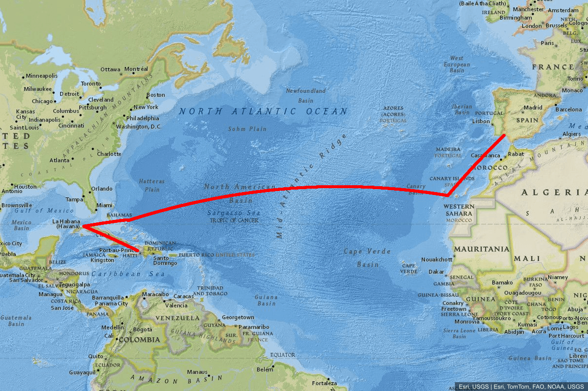
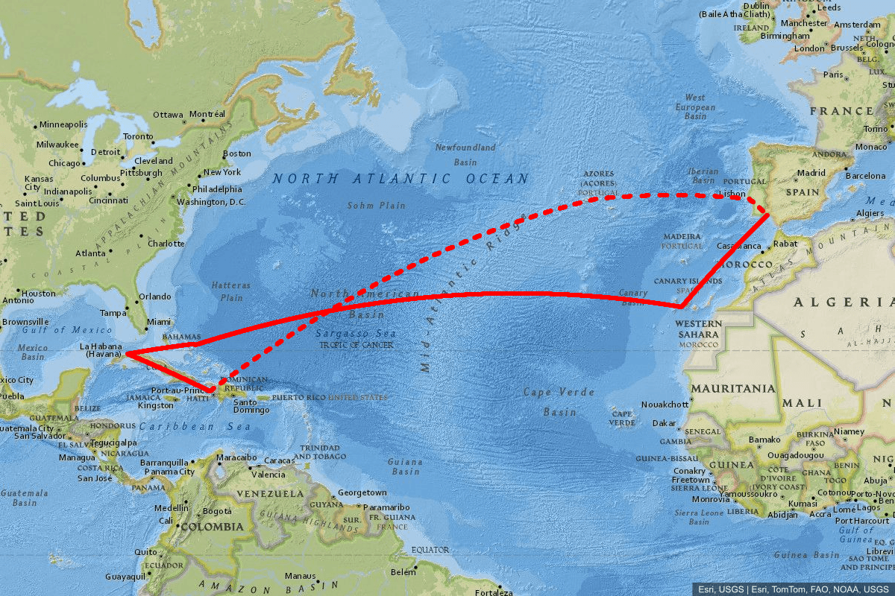

# Polylines

To add one or more polylines, use the `polyline` parameter one or multiple times in the URL query in the following format:

```
polyline=polylineStyle|polylineCoord1|polylineCoord2|...
```

- **polylineCoord**:
  - **Lat, Lon Coordinates**: Coordinates in `lat, lon` format, separated by `|`. You need at least two coordinates.
  - **Encoded Polylines**: You can also use [Google Encoded Polyline](https://developers.google.com/maps/documentation/utilities/polylinealgorithm "Google Encoded Polyline") format.

- **polylineStyle**: Customize the polyline with:

  | Parameter | Default | Description |
  | --- | --- | --- |
  | `weight` | `6` | Sets the stroke width of the polyline. |
  | `color` | `#0000ff` | Defines the stroke color of the polyline. |
  | `fill` |  | Specifies the fill color of the polyline. |
  | `strokeDasharray` | (none) | Pattern of dashes and gaps, e.g., `5,5` see [stroke-dasharray](https://developer.mozilla.org/de/docs/Web/CSS/stroke-dasharray). |
  | `withGeodesicLine` | `true` | When `true`, generates geodesic lines between each pair of coordinates. Set to `false` to draw straight lines. |

Note: By default, for each pair of coordinates in the input, a geodesic line is generated between them. You can disable this behavior by setting `withGeodesicLine:false`.

<details>
  <summary>Regular Coordinates example with <code>no zoom</code>, <code>weight:6</code>, <code>color:0000ff</code></summary>
  <p>http://localhost:3000/api/staticmaps?width=1200&height=800&format=png&basemap=national-geographic&polyline=weight:6|color:red|37.2159,-7.0050|28.0997,-17.1092&polyline=weight:6|color:red|28.0997,-17.1092|24.0617,-74.4767&polyline=weight:6|color:red|24.0617,-74.4767|24.2000,-74.5000&polyline=weight:6|color:red|24.2000,-74.5000|23.1167,-82.3833&polyline=weight:6|color:red|23.1167,-82.3833|19.0000,-72.7000</p>
</details>



<details>
  <summary>Multiple Encoded Polylines</summary>
  <p>http://localhost:3000/api/staticmaps?width=1200&height=800&format=png&basemap=national-geographic&polyline=weight:6|color:red|kvcbFfdwi@fosv@fnt|@ntsWzqc}Ik_ZrpCrqrErubo@j`cXsgbz@&polyline=weight:6|color:red|strokeDasharray:10,15|_}}rB~evzLs}iwBseqtG?_{jmBfddHc~_L</p>
</details>


